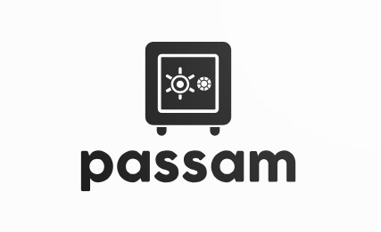
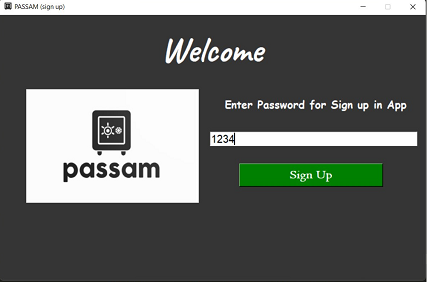
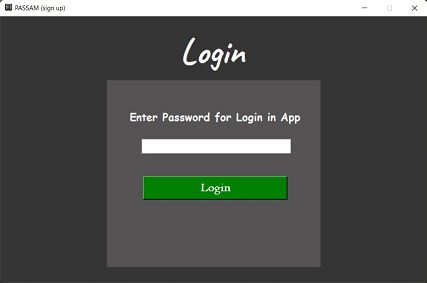
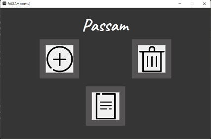
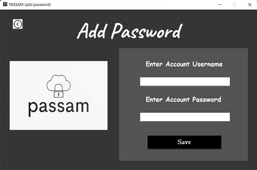

# PasswordManager
This project is a password manager that has been developed using Python as the primary programming language. It utilizes the tkinter library to create an intuitive user interface for enhanced user experience.

<p align="center">
  
</p>

<p align="center">
  <a heref="https://www.python.org/downloads/"></a>
  <a href="https://pypi.org/project/tk/"></a>
  <a href="https://pypi.org/project/cryptography/"></a>
  <a href="https://pypi.org/project/Pillow/"></a>
</p>

## Intro
The password manager aims to securely store sensitive login details and passwords for various online accounts, ensuring users no longer need to remember multiple complex passwords. With this project, users can conveniently save, retrieve, and update their login information within a well-organized interface.

Python's robustness allows for implementing strong encryption algorithms that guarantee the confidentiality and integrity of stored passwords. Users can rely on this password manager to safeguard their sensitive information effectively.

The user interface, designed with tkinter library, provides a clean and user-friendly environment to interact with the password manager. It offers easy-to-use features like input fields for adding new passwords, viewing stored passwords.
## Description
This project is written in Python programming language and no other language is used in this project
All the codes of this project are in the main.py file
Note: This project contains three text files, one for verifying user registration and one for saving the program password
and another one to store accounts and passwords of user accounts
### Watch videos of this project on YouTube
<a href="https://www.youtube.com/channel/UC_S-8rbb5mkflavd4kzHdzg"></a>

## Installation
### Libraries used
#### cryptography
```bash
pip install cryptography
```
#### tkinter
```bash
pip install tk
```
#### pillow
```bash
pip install Pillow
```
### How to import libraries
```python
#import user interface package
from tkinter import *
#import package for use image in project
from PIL import ImageTk , Image #(pillow)
#alertDialog
from tkinter import messagebox
#import the encryption and decryption package
from cryptography.fernet import Fernet
```
## Preview
<p align="center">
  
  
  
  
</p>

# Join our Community:
  <a href="https://www.youtube.com/channel/UC_S-8rbb5mkflavd4kzHdzg">
    </a>&ensp;&nbsp;&nbsp;
    <a href="https://www.instagram.com/mojtabagolab1/">
    

